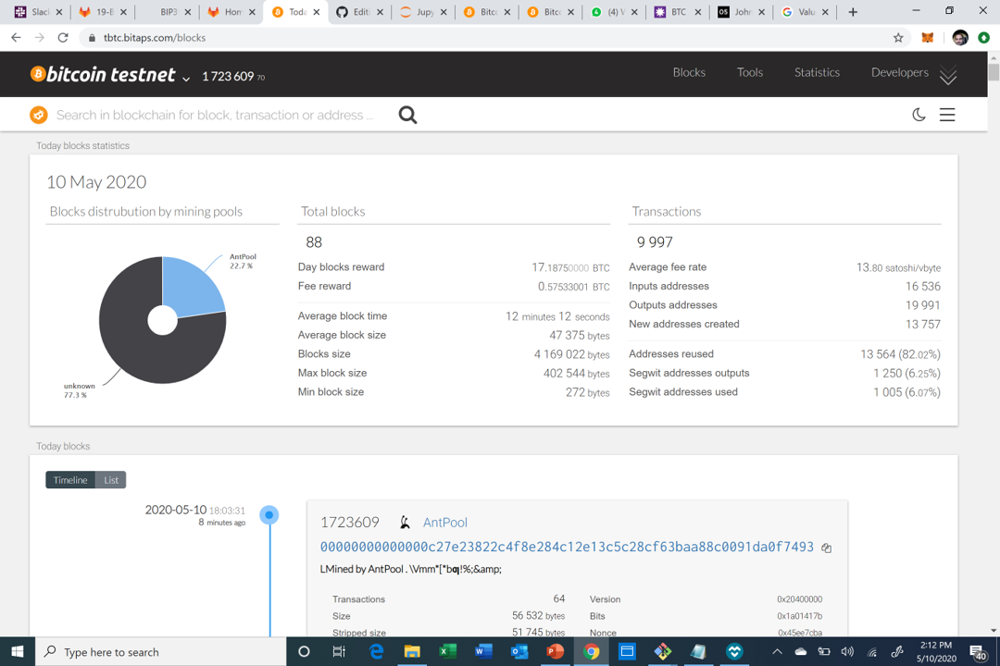
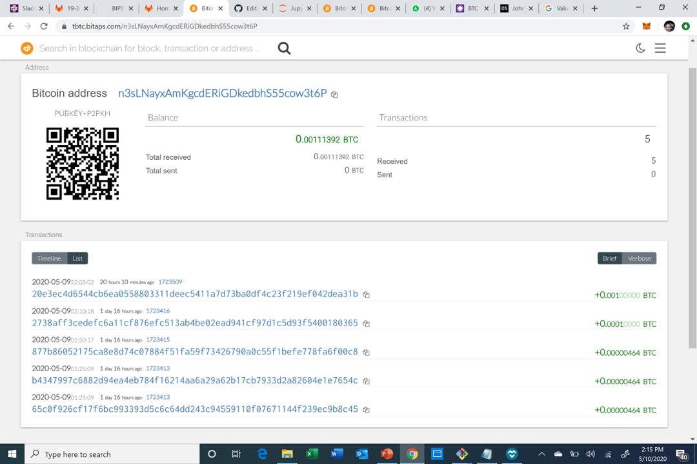
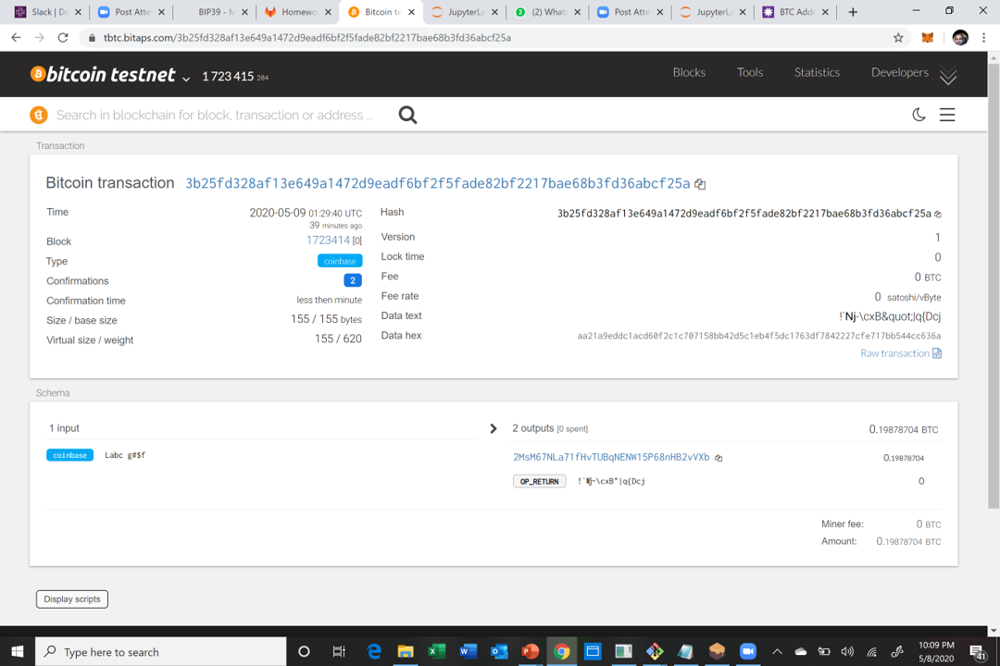
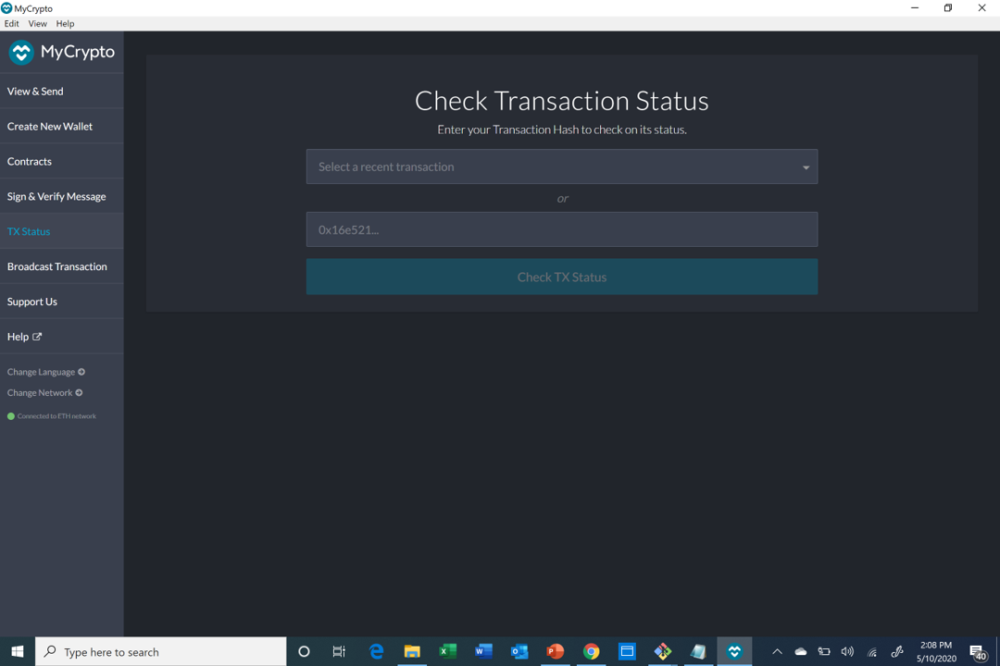
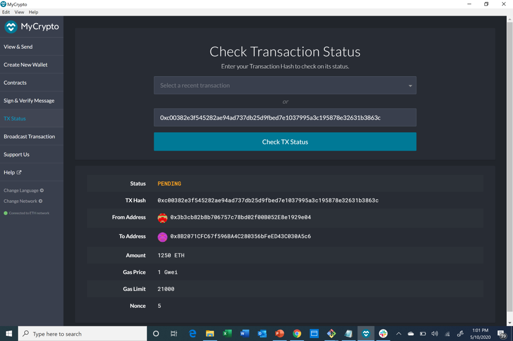
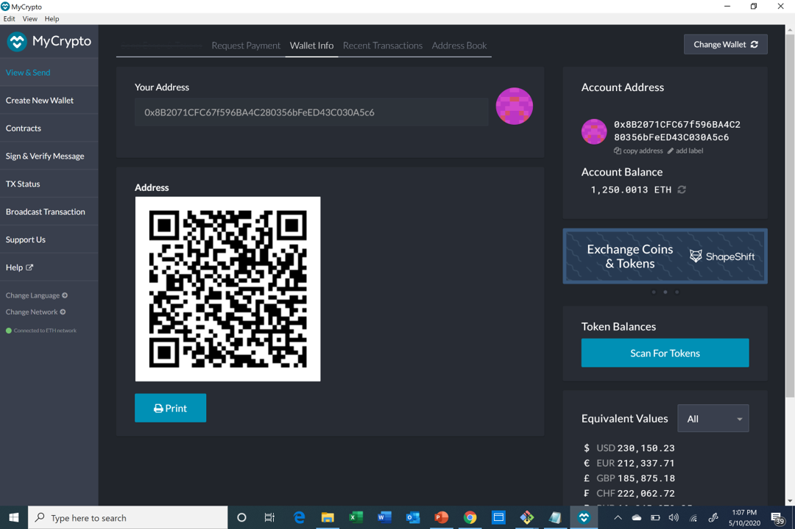

# **Assignment 19: Multi-Blockchain Wallet in Python**

## **Overview**

This wallet will allow the user to transfer ETH or BTC test coins to other designated accounts. It was built using PHP,bit (bitcoin library) and web3.py (Ethereum library) and to use this wallet you simply need to run the code in the following functions:

**1. Derive wallets:**

    def derive_wallets (mnemonic,coin,number):
    command = f'php ./hd-wallet-derive/hd-wallet-derive.php --mnemonic="{mnemonic}" -g --numderive="{number}" --coin="{coin}"               --cols=address,index,path,privkey,pubkey,pubkeyhash,xprv,xpub --format=json'
    p = subprocess.Popen(command, stdout=subprocess.PIPE, shell=True)
    (output, err) =p.communicate()
    p_status = p.wait()
    keys = json.loads(output)
    return keys
    
    Note: If you are using a MAC computer you will need to replace ./hd-wallet-derive/hd-wallet-derive.php with ./derive
    
**2. Linking the transaction signing libraries:**

    def priv_key_to_account (coin, priv_key):
    if coin == ETH:
        return Account.privateKeyToAccount(priv_key)
    elif coin == BTCTEST:
        return PrivateKeyTestnet(priv_key)
        
**3. Creating the transaction:**

    def create_tx(coin, account, to, amount):
    if coin == ETH:
        gasEstimate = w3.eth.estimateGas(
        {"from": eth_acc.address, "to": to, "value": amount}
    )
        return {
            "from": eth_acc.address,
            "to": to,
            "value": amount,
            "gasPrice": w3.eth.gasPrice,
            "gas": gasEstimate,
            "nonce": w3.eth.getTransactionCount(account.address),    
    }
    
    elif coin == BTCTEST:
        return PrivateKeyTestnet.prepare_transaction(account.address, [(to, amount, BTC)])
        
**4. Sending the transaction:**

    def send_tx(coin,account, recipient, amount):
        tx = create_tx(coin,account,recipient,amount)

        if coin == ETH:
            signed_tx = eth_acc.sign_transaction(tx)
            result = w3.eth.sendRawTransaction(signed_tx.rawTransaction)
            return result.hex()
        elif coin == BTCTEST:
            signed_tx = btc_acc.sign_transaction(tx)
            return NetworkAPI.broadcast_tx_testnet(signed_tx)
            
Once you run these functions you will have the choice to transact with either ETH or BTC test coins. Alternatively you can use the following command in a Git Bash or Terminal window:

from wallet import *

Below are examples of successful transactions with both the BTC and ETH test coins.

## **BTCTEST Coin Transacion**

Send a BTC test coin transaction by inputting the following code:

    send_tx(BTCTEST,btc_acc,'n3sLNayxAmKgcdERiGDkedbhS55cow3t6P',.001)

##### Note: I inputted .001 coins as the amount to transfer. Feel free to play with the amount. You may need to put some money into your account from this web address https://coinfaucet.eu/en/btc-testnet/.
        
Once you run this code you will need to copy the recipients (or senders) address to see the balance. Once you copy the address navigate to the following website https://tbtc.bitaps.com/blocks. At this website paste your address in the prompt on the upper left hand side of the screen

Once you input your address you will get the below screen:

On this screen click on one of the transactions highlighted in blue, click on the link:

 This will lead you to your BTC transaction confirmation as seen below:

## **ETH Coin Transaciton**

Send a BTC test coin transaction by inputting the following code:

    send_tx(ETH,eth_acc,'0x8B2071CFC67f596BA4C280356bFeED43C030A5c6',1250000000000000000000)

After running the send_tx function you will get a hash key. Copy that hash and open myCrypto and select TX Status from the left hand side. You will be prompted to input the hash key. 

After inputting the hash key you will get the confirmation of the transaction for that account:

You can also check your general balance on myCrypto by changing wallet and selecting the Address access option and input your account address:

## **Core Requirements**

Include installing pip dependencies using requirements.txt, as well as cloning and installing hd-wallet-derive.
You may include the hd-wallet-derive folder in your repo, but still include the install instructions. You do not
need to include Python or PHP installation instructions.

### **HD Derive Wallet Installation process**

The hd-wallet-derive library is written in the PHP language; hence, you will need to first install and setup PHP on your machines before installing and then running the hd-wallet-derive library.

Please follow the below links to start the process of installing the required software:

### **Windows User**

1. PHP: https://www.youtube.com/watch?v=IvcZZaIEL_4&feature=youtu.be
2. HD-Wallet-Derive: https://www.youtube.com/watch?v=A_tqm4j4vsY&feature=youtu.be

### **MAC Users**

1. PHP Option 1: https://www.youtube.com/watch?v=Q3RA7PiW9Ws&feature=youtu.be
2. PHP Option 2: https://www.youtube.com/watch?v=SNRQSwlOKbs&feature=youtu.be
3. HD-Wallet-Derive: https://www.youtube.com/watch?v=c-Qc3Pss6oM&feature=youtu.be

Note: After installing PHP you will need to open the php.ini file and add this syntax to the end of the document **extension=php_gmp.dll**

